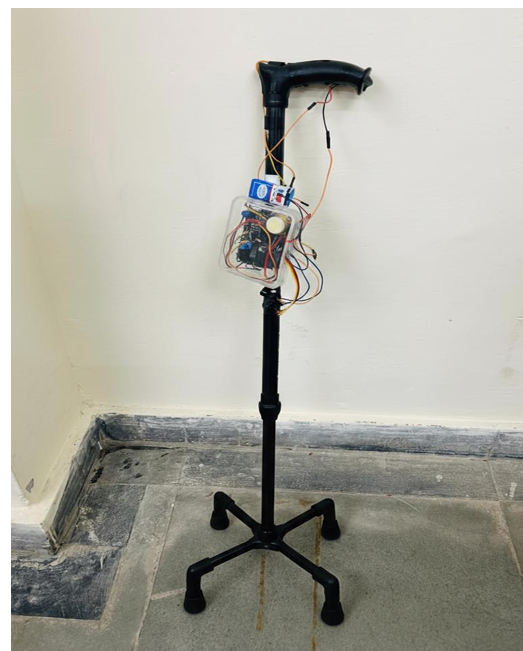

# CaneSentinel — IoT Pre-Fall Detection System

An IoT-based assistive device designed for quad-cane users to detect instability and pre-fall tilt dynamics before a fall occurs.

## Overview
- **Microcontroller:** Arduino Nano
- **Sensors:** ADXL345 3-Axis Accelerometer, FSR Force Sensors
- **Feedback:** Vibration Motor & Buzzer Alarm

## Hardware Setup

## How It Works
1. Continuous polling of tilt angles and user grip pressure.
2. Triggers an alert sequence when threshold tilt exceeds safety limits during ground contact.
